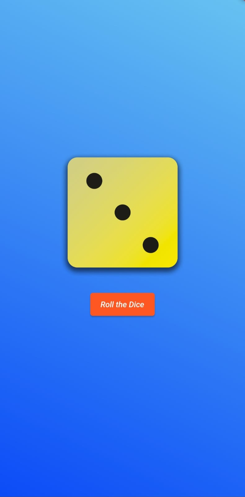

# Dice App

The Dice Roller App is a simple and user-friendly application that allows users to roll a virtual dice and view a random dice face upon clicking the "Roll Dice" button. This app is designed to provide a digital alternative to physical dice for various gaming and recreational purposes.

## Features
### Roll Dice Button: The main functionality of the app is centered around the "Roll Dice" button. Upon clicking this button, the app generates a random number between 1 and 6, representing the different sides of a standard dice. The corresponding dice face image is then displayed to the user.

### Realistic Dice Faces: The app uses high-quality graphics to display realistic representations of dice faces. This adds to the immersive experience and makes the virtual dice rolling feel more authentic.

### User-Friendly Interface: The app boasts a simple and intuitive user interface, making it easy for users of all ages to quickly understand and use the application.

## Getting Started
To use the Dice Roller App, follow these steps:

### Usage:

1.Upon launching the app, you will see the main interface with a "Roll Dice" button.
2.Click the "Roll Dice" button to initiate the dice rolling animation.
3.Once the animation completes, the app will display a random dice face.
4.You can click the "Roll Dice" button again to roll the dice as many times as you like.

### Contributions and Feedback
Contributions to the Dice Roller App are welcome! If you have ideas for improvements or additional features, feel free to fork this repository and submit a pull request. If you encounter any issues or have feedback, please open an issue in the repository's issue tracker.

